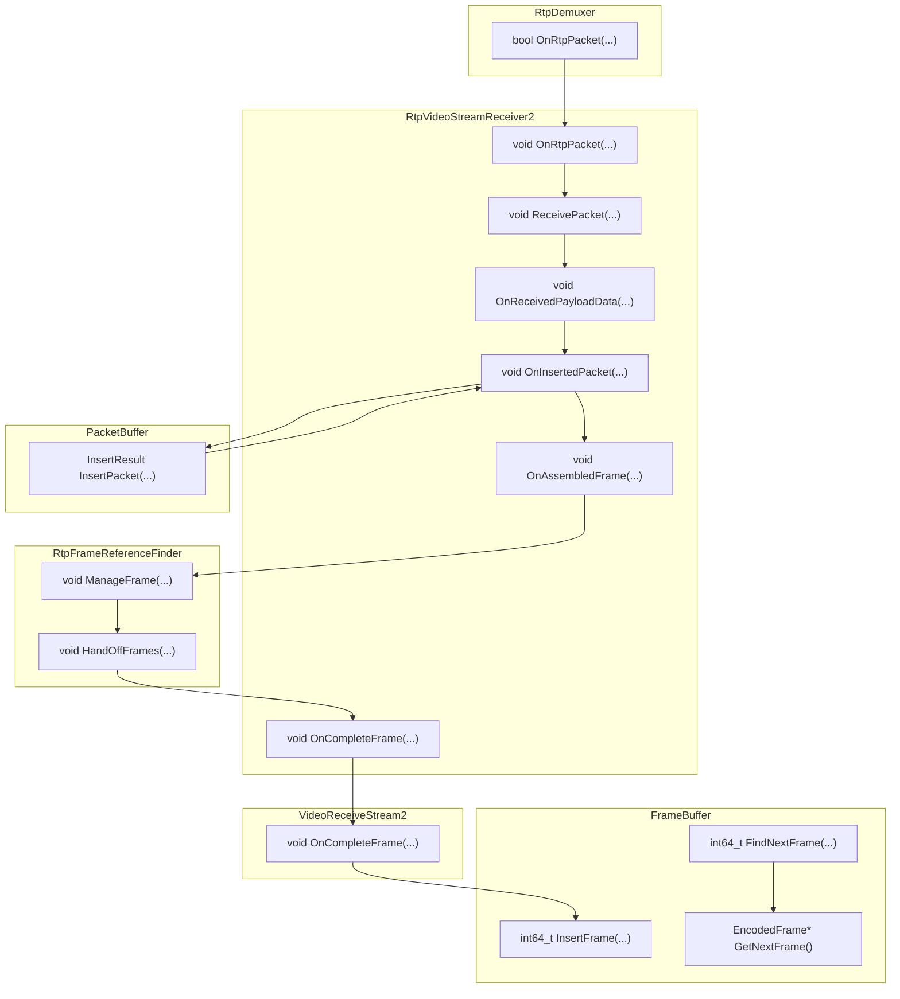
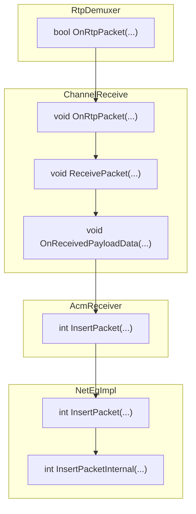

> 对测试过程中的QoS数据采集进行整理

# 视频
## 视频数据流转过程
继续`MigrationLog.md`中的流程图：

## 数据采集
### RtpVideoStreamReceiver2

| 数据项   | 日志位置  |
|--------|--------|
| [InsertPacket]| `video/rtp_video_stream_receiver2.cc:788`|
| [FirstAndLastPair]| `video/rtp_video_stream_receiver2.cc:866` |
| [AssembleFrame] | `video/rtp_video_stream_receiver2.cc:941`|

### RtpSeqNumOnlyRefFinder

| 数据项   | 日志位置  |
|--------|--------|
| [ManageFrameInternal] | `modules/video_coding/rtp_seq_num_only_ref_finder.cc:23:118` |

### FrameBuffer

| 数据项   | 日志位置  |
|--------|--------|
| [InsertFrame]| `modules/video_coding/frame_buffer2.cc:463` |

### VideoReceiveStream2

| 数据项   | 日志位置  |
|--------|--------|
| LogStats()| `video/video_receive_stream2.cc:508:566:624:632` |

包含数据如下：
| 数据项  | 说明   |
|--------|--------|
| network_frame_rate | 网络帧率|
| current_delay_ms | 当前延迟 |
| target_delay_ms| 目标延迟 |
| jitter_buffer_ms | jitter buffer的大小 |
| total_bitrate_bps | 视频流总数据率|
| rtp_packet_count| RTP包接收数量|
| rtp_jitter| rtp包抖动值|

# 音频

## 音频数据流转过程

## 数据采集

### NetEqImpl
| 数据项   | 日志位置  |
|--------|--------|
| [Buffer]| `modules/audio_coding/neteq/neteq_impl.cc:194:264:1290` |
|[Operation]|`modules/audio_coding/neteq/neteq_impl.cc:1291`|
|[Insert]|`modules/audio_coding/neteq/neteq_impl.cc:195`|

buffer中的相关数据如下所示

| 数据项|说明 |
|-|-|
|packet_buffer_size_ms|packet buffer中的音频数据量，存储音频数据包|
|sync_buffer_size_ms|同步缓冲区中的音频数据量，存储已经解码但是还没播放的音频数据|
|filtered_buffer_level_ms|filter计算以后的buffer值|
|output_delay_chain_ms|累计延迟，是一个校准值|
|target_level_ms|设定的理想buffer数据量|

