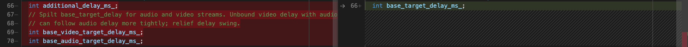

> 主要关注`zorro_android_sdk/src/third_party/webrtc`

# Zorro SDK 如何调用 WebRTC

主要关注`zorro_android_sdk/src/third_party/webrtc/zorro/`

## zorro::CallManager

全局单例，管理几乎所有的通话信息。整个通话过程中的控制流都在CallManager手上，包括媒体流、房间信息等。

CallManager的多线程用的是WebRTC的多线程机制。可以将CallManager在会话中的角色看作PeerConnection

> 参见 `webrtc/src/pc/peer_connection.cc`

```cpp
// CallManager 持有Thread对象
std::unique_ptr<rtc::Thread> signaling_thread_;
std::unique_ptr<rtc::Thread> worker_thread_;
std::unique_ptr<rtc::Thread> network_thread_;
```

在`call_manager.cc`中定义了很多种`rtc::MessageData`，用于CallManager的控制流管理。所以实际上就是用WebRTC的消息队列，例如

```cpp
int CallManager::SetRtcEngineConfig(RtcEngineObserverInterface* observer,
                                    const std::string& app_id,
                                    const std::string& country_code) {
  ...

  SetRtcEngineConfigMsg* msg = new SetRtcEngineConfigMsg(app_id, country_code);
  SignalingThread()->Post(RTC_FROM_HERE, this, MSG_SET_RTC_ENGINE_CONFIG, msg);
  ...
}
```

## zorro::MediaEngine

CallManager通过持有的MediaEngine来管理媒体流；

可以直接理解为WebRTC中的media engine，即持有
- Capture Device
- Player Device
- MediaStream

MediaStream持有所有的媒体track（track就是一个单向的媒体传输）
```cpp
const std::string id_;
AudioTrackVector audio_tracks_;
VideoTrackVector video_tracks_;
```

# Zorro SDK 在接收端的修改

## webrtc::DelayManager
`modules/audio_coding/neteq/delay_manager.cc`

功能是在NetEq中**维护音频数据接收和播放之间的延迟**

`DelayManager::Update()` 在 `DecisionLogic::PacketArrived` 之中被调用，用于在新的数据包到来时更新延迟计算。这个函数在zorro SDK（左）中有较大改动：


```cpp
// original
const int iat_ms = packet_iat_stopwatch_->ElapsedMs();

// modified
int iat_ms = packet_iat_stopwatch_->ElapsedMs();
int64_t current_time_ms = rtc::TimeMillis();
if (last_update_time_ms_ != 0) {
  iat_ms = current_time_ms - last_update_time_ms_;
}
last_update_time_ms_ = current_time_ms;
```

“iat”就是 inter-arrival time，也就是两个连续包之间的间隔。

显然这里的改动是用时钟计时代替了`packet_iat_stopwatch_`

```cpp
// modification
reorder_prob_ = reorder_prob_ * 0.999f + (reordered ? 0.001 : 0);
RTC_LOG_D_C << reorder_prob_;
if (reordered) {
  if (relative_delay - min_disordered_delay_ > target_noret_ms_ / 2) {
    disordered_delay_ = 0.99f * disordered_delay_+ 0.01f * pow(relative_delay, 2);
    more_delay_for_audience_ms_ =
        int(fmax(0, sqrt(disordered_delay_) - target_noret_ms_) *
            (1 - reorder_prob_) + min_disordered_delay_);
    RTC_LOG_D_C << "rtt from reorder is: " << more_delay_for_audience_ms_;
  } else {
    min_disordered_delay_ =
        fmin(min_disordered_delay_,
             0.8 * min_disordered_delay_ + 0.2f * relative_delay);
    RTC_LOG_D_C << "min delay from reorder is: " << min_disordered_delay_;
  }
} else {
  min_disordered_delay_ = fmax(min_disordered_delay_,
      0.8 * min_disordered_delay_ + 0.2f * relative_delay);
  RTC_LOG_D_C << "not reorder delay from reorder: " << relative_delay;
}
```

`reorder_prob`  是乱序的概率，是一个累计值。

如果检测到这个包是乱序包，并且

`relative_delay - min_disordered_delay_ > target_noret_ms_ / 2`

那么计算：
- `disordered_delay_`  累计失序延迟平方均值
- `more_delay_for_audience_ms`  

```cpp
// original
target_level_ms_ = (1 + bucket_index) * kBucketSizeMs;
target_level_ms_ = std::max(target_level_ms_, effective_minimum_delay_ms_);
if (maximum_delay_ms_ > 0) {
  target_level_ms_ = std::min(target_level_ms_, maximum_delay_ms_);
}
if (packet_len_ms_ > 0) {
  // Target level should be at least one packet.
  target_level_ms_ = std::max(target_level_ms_, packet_len_ms_);
  // Limit to 75% of maximum buffer size.
  target_level_ms_ = std::min(
      target_level_ms_, 3 * max_packets_in_buffer_ * packet_len_ms_ / 4);
}

// modification
int safe_bucket_index = histogram_->Quantile((1 << 30) * 0.97);
target_noret_ms_ = (1 + 3 * bucket_index) * kBucketSizeMs;
int more_delay_for_audience =
    fmin((safe_bucket_index + 1) * kBucketSizeMs - target_noret_ms_,
         more_delay_for_audience_ms_);
more_delay_for_audience = fmax(more_delay_for_audience, 0);
if (zorro::JoinChanExtraInfo::IsAudioFecEnabled(remote_info_)) {
  switch(local_scenario_) {
    case NetEq::Scenario::kAudioSendRecv: {
      target_level_ms_ = target_noret_ms_ + 1.5 * more_delay_for_audience;
      break;
    }
    case NetEq::Scenario::kAudioRecvOnly: {
      target_level_ms_ = target_noret_ms_ + 2.5 * more_delay_for_audience;
      break;
    }
    case NetEq::Scenario::kAudioSendRecvLowLatency: {
      target_level_ms_ = target_noret_ms_ / 2 + more_delay_for_audience;
      break;
    }
    case NetEq::Scenario::kInvalid:
    case NetEq::Scenario::kVideo: {
      target_level_ms_ = target_noret_ms_ + 4 * more_delay_for_audience;
      break;
    }   
  }
} else {
  target_level_ms_ = (safe_bucket_index + 1) * kBucketSizeMs;
}
```

计算音频预估缓冲量`target_level_ms`的算法进行改动。
- 在开启了音频FEC的情况下，加入了不同场景的判断；
- `int webrtc::Histogram::Quantile(int probability)`的功能是计算分位点。这里`histogram_->Quantile((1 << 30) * 0.97)`是计算97%的分位点，因为Histogram的区间总长就是`1<<30`


## webrtc::RtpSeqNumOnlyRefFinder

`modules/video_coding/rtp_seq_num_only_ref_finder.cc`


清理历史帧的区间加长，也就是留下更多历史帧


对关键帧的handoff策略作了修改：如果stash里有更早的非关键帧，那么就先留下这个可以handoff的关键帧。直到这些更早的帧因为超时被清除，关键帧才会被handoff。

## webrtc::VCMTiming

`modules/video_coding/timing.cc`


zorro对`VCMTiming::UpdateCurrentDelay(int64_t render_time_ms,int64_t actual_decode_time_ms)`做了大量修改：


1. 为了和音频同步，目标视频延迟不再返回目标延迟而是当前延迟；
2. 为了弥补上面的改动导致无法获得基准视频延迟，添加了一个方法`BaseTargetVideoDelay`

## webrtc::StreamSychronization


在变量上做了一些修改，不再以音频delay为准，而是将音频和视频的base_target_delay分开，这样可以更灵活地调整同步策略。

在 `StreamSynchronization::ComputeDelays`和`StreamSynchronization::SetTargetBufferingDelay`中的改动基本围绕这个base target delay的改动进行。


## webrtc::AudioReceiveStream::Config
媒体流设置项也有改动，这里就只举音频的例子。


添加了`estimated_e2e_delay`和`fraction_lost`

音频流添加了RTX流

# Zorro SDK在发送端的修改
（待补充）