# WebRTC source V.S. Zorro webrtc

对`webrtc/src`和`zorro/src/third_party/webrtc`下的重要目录进行对比

## api/

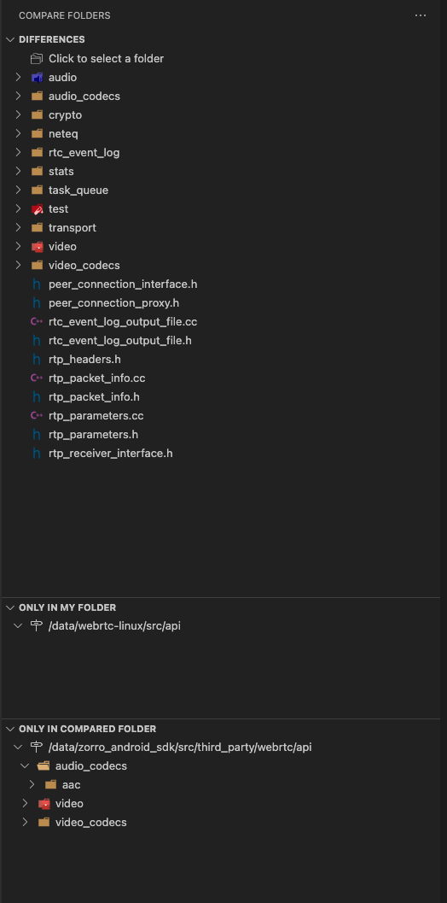

## audio/
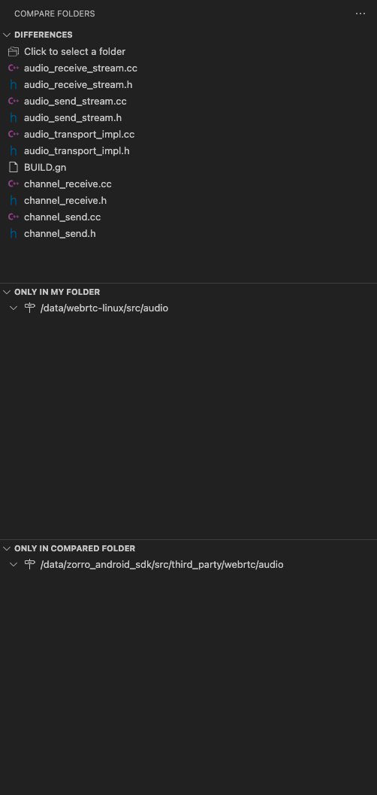

## call/

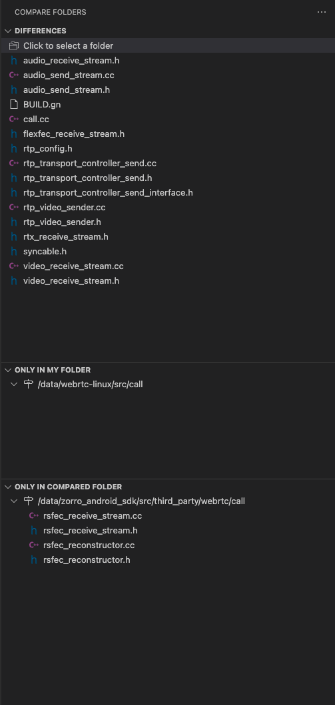

## common_audio/
sychronized

## common_video/

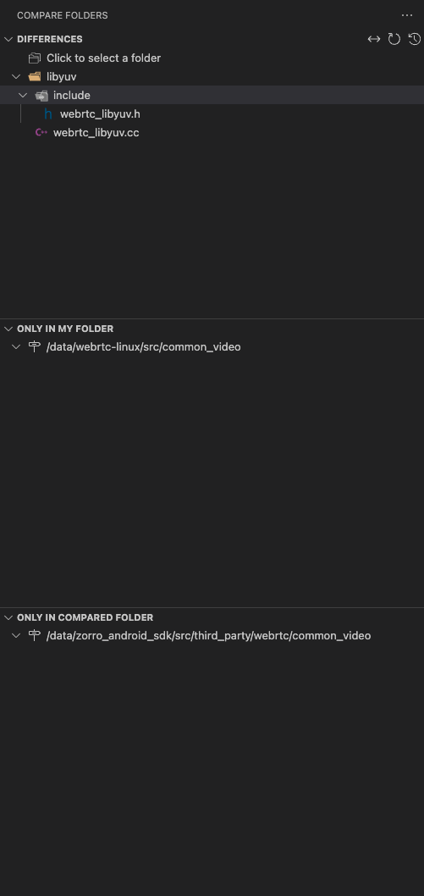

## media/
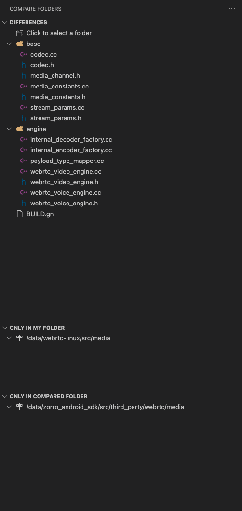

## modules/

这里的改动比较多，进行一些展开：

### audio_coding/

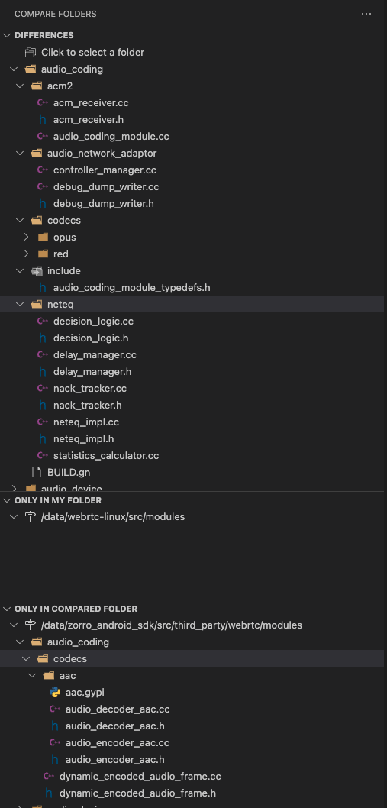

### audio_device/
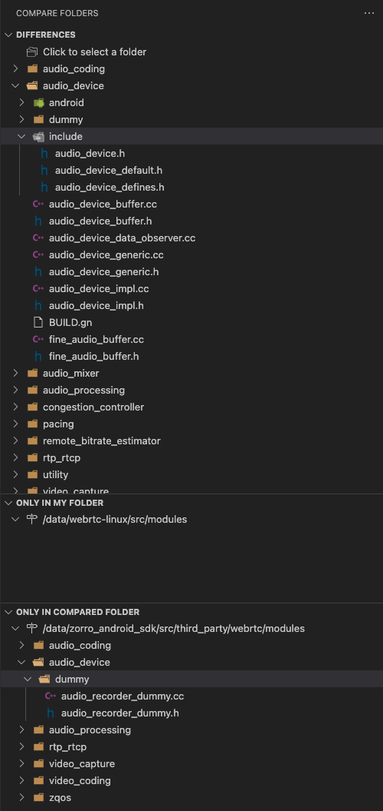

### audio_mixer/

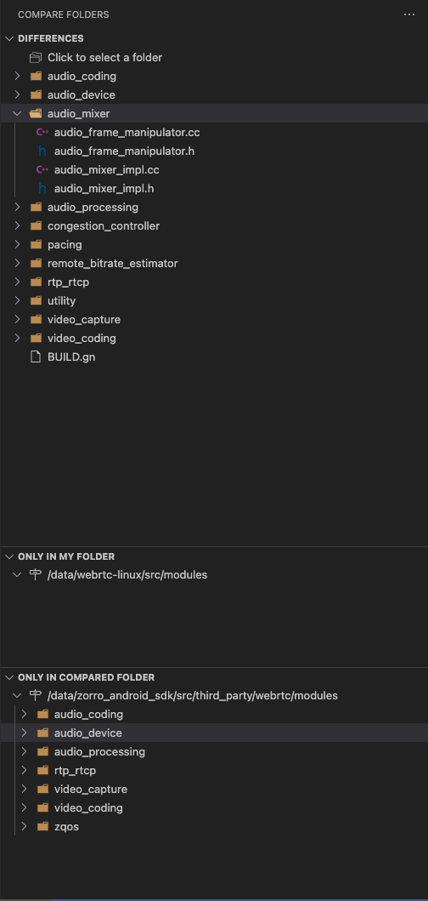

### audio_processing/

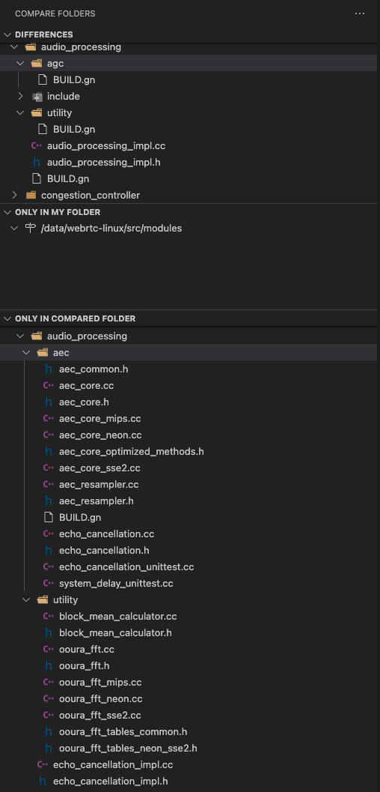

### congestion_controller/

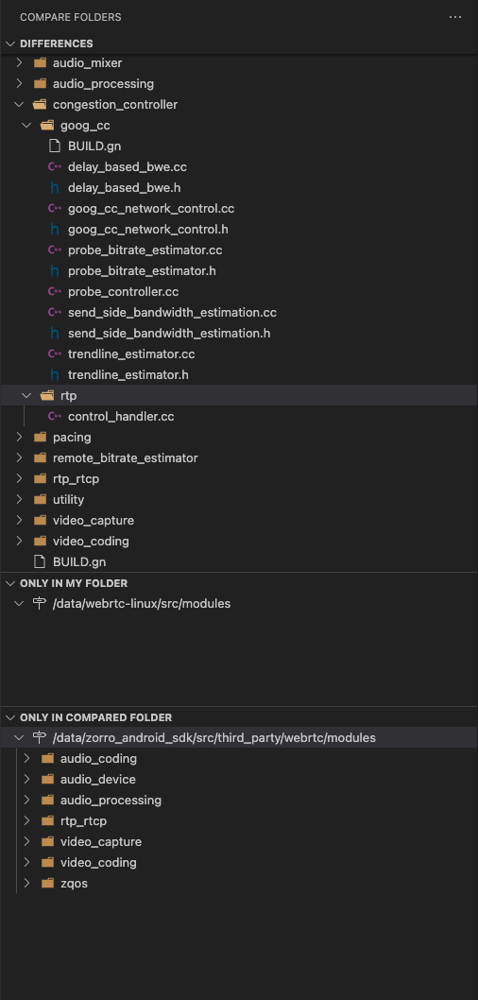

### pacing/

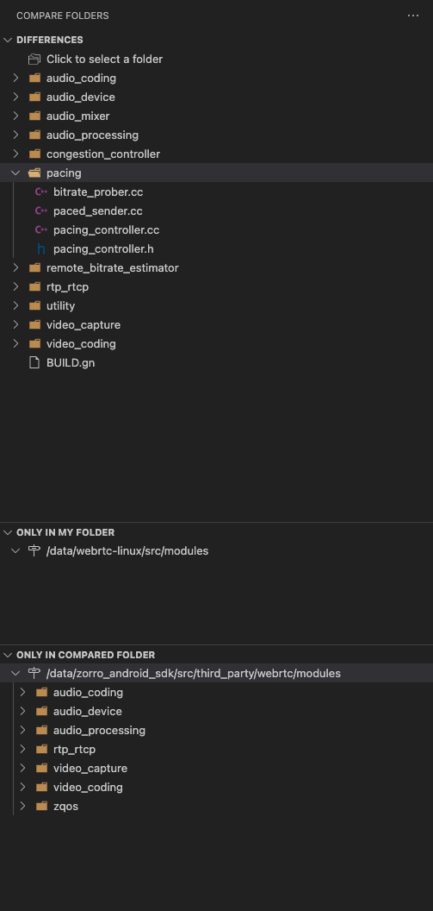

### remote_bitrate_estimator/

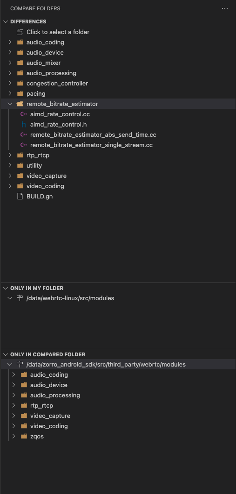

### rtp_rtcp/

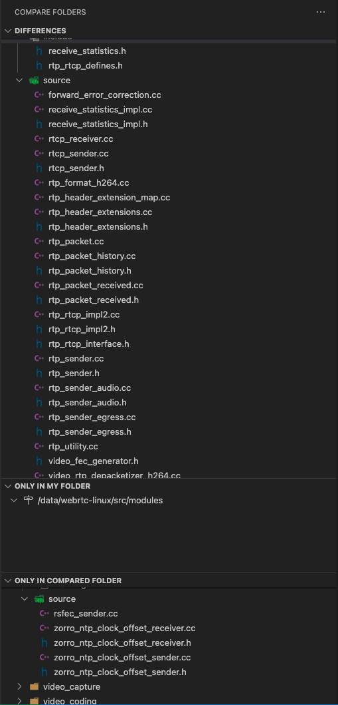

### video_capture/

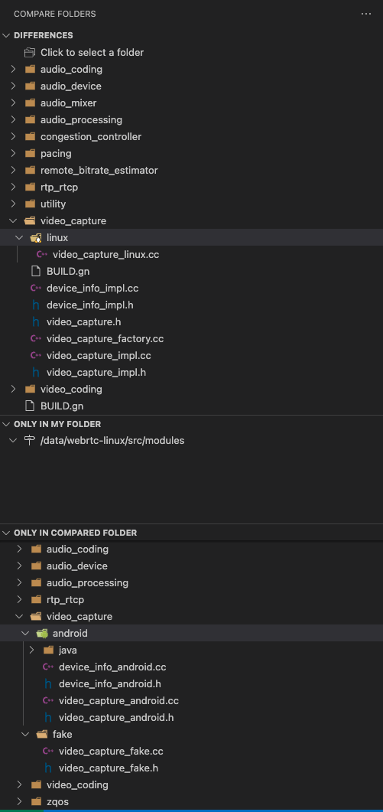

### video_coding/

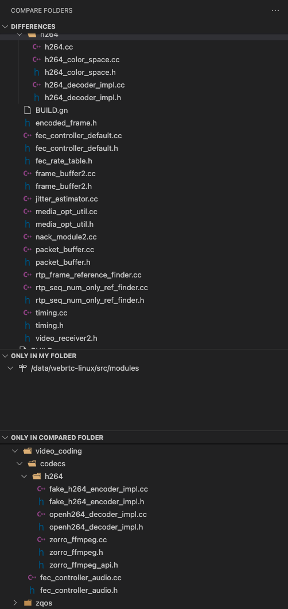

### zqos/

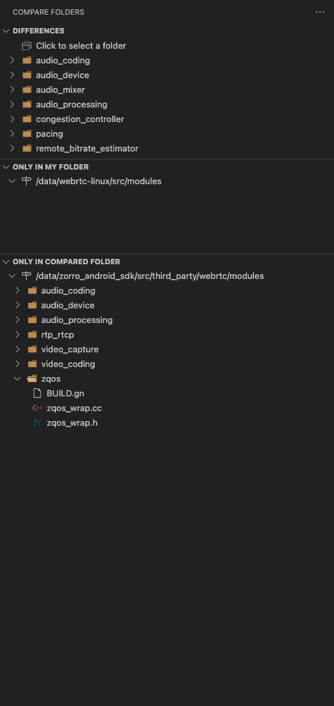

## system_wrappers/

sychronized

## test/

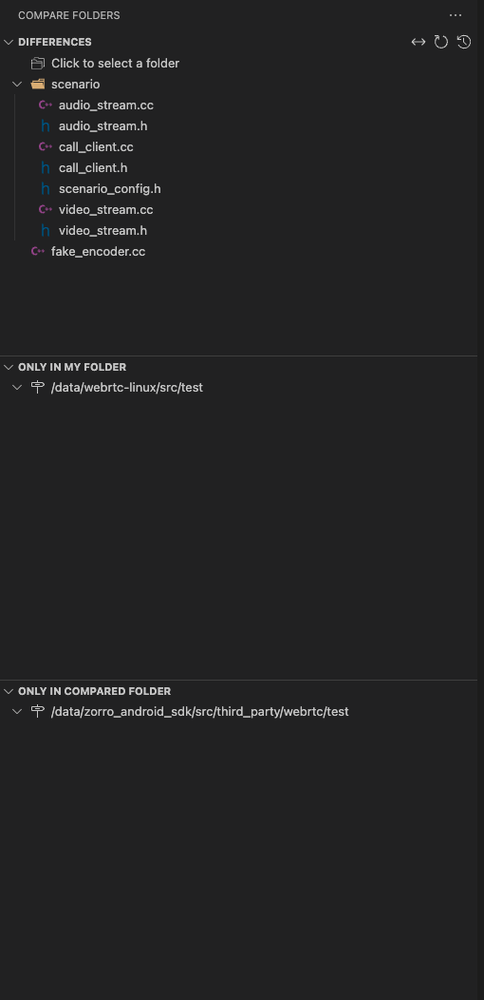

## video/

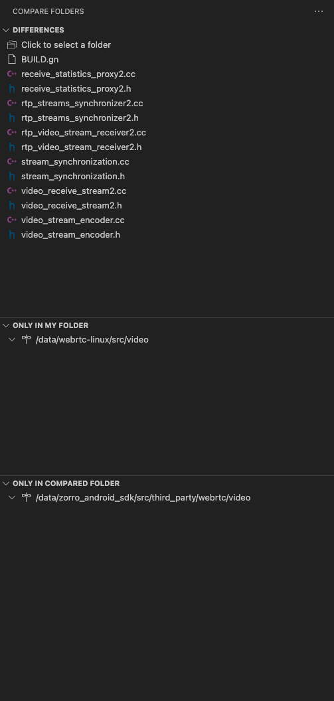