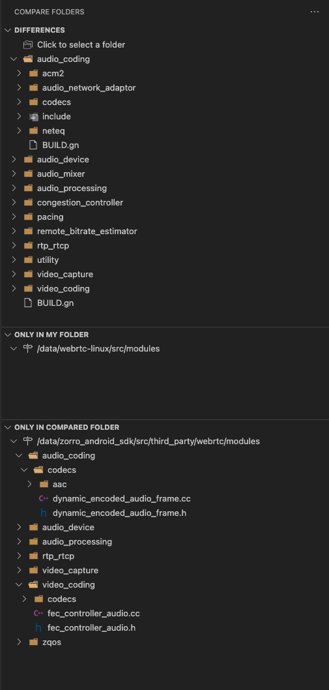

# WebRTC source V.S. Zorro webrtc

对`webrtc/src`和`zorro/src/third_party/webrtc`下的重要目录进行对比

## api/

## audio/

## call/

## common_audio/
sychronized

## common_video/

## media/

## modules/

这里的改动比较多，进行一些展开：

### audio_coding/

### audio_device/

### audio_mixer/

### audio_processing/

### congestion_controller/

### pacing/

### remote_bitrate_estimator/

### rtp_rtcp/

### video_capture/

### video_coding/

### zqos/

## system_wrappers/

sychronized

## test/

## video/

