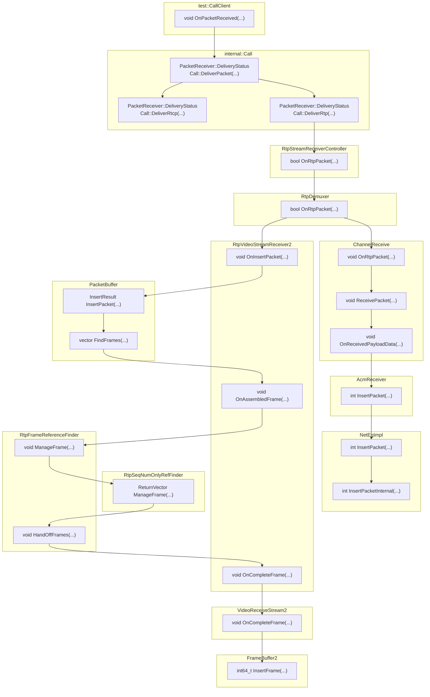

> 2023-05-04 Migrated from MBP local daily notes

# 关于WebRTC源码
## ninja的使用
- ninja是build tool，其地位相当于Make。ninja就是为了解决Make在编译大型工程时太慢的问题。
- CMake是build generator，ninja也需要CMake来生成

例如，在下面的目录中
```
CMakeLists.txt  main.cpp    build.ninja
```
build.ninja是编译构建的目录
```
cd build.ninja && cmake .. -G Ninja
```
此时开始编译，生成的内容都在build.ninja

## 拉取WebRTC源码
for linux
1. 安装depot-tools
```
git clone https://chromium.googlesource.com/chromium/tools/depot_tools.git
```
2. 获取源代码
```
fetch --nohooks webrtc
gclient sync
```
3. 切换到指定分支

[分支号码和版本号对照](https://chromiumdash.appspot.com/branches)

```
git branch -a
git checkout -b m92 branch-heads/4515
```
如果本地仓库没有想要的分支：
添加一个名为webrtc的远端仓库
```
git remote add webrtc https://webrtc/googlesource.com/src.git
```
打开git config添加内容
```
vim .git/config
#文件末尾有一个[remote "webrtc"]的配置项，在此项的末尾加上
fetch = +refs/branch-heads/*:refs/remotes/origin/*
```
然后拉下此分支
git fetch webrtc

4. 编译
```
cd src && ./build/install-build-deps.sh
gn gen out/m92 --args='is_debug=false is_component_build=false is_clang=true rtc_include_tests=false rtc_use_h264=true rtc_enable_protobuf=false use_rtti=true use_custom_libcxx=false treat_warnings_as_errors=false use_ozone=true' && ninja -C out/m92
```

# ns3相关
基础环境
```
sudo DEBIAN_FRONTEND=noninteractive apt install build-essential autoconf automake libxmu-dev python3-pygraphviz cvs mercurial bzr git cmake p7zip-full python3-matplotlib python-tk python3-dev qt5-qmake qt5-default gnuplot-x11 wireshark clang net-tools libpcap-dev libatomic-ops-dev -y
```
用到Pcapplusplus项目
[github地址](https://github.com/seladb/PcapPlusPlus/releases/tag/v22.11)

设置环境变量
```
export WEBRTC_SRC_PATH=
export PCAP_SRC_PATH=
export LDFLAGS_EXTRA="-latomic -ldl -lpcap"
```

# WebRTC内部
## 流程跟踪

pcap-webrtc内部将ns3下的网络包对接到WebRTC之中。

`FrameBuffer2` 和 `NetEqImpl` 是视频/音频的帧数据在播放之前的缓冲区，从Call接收RTP数据到缓冲区的过程如下流程图所示：


## 音频

- packet_buffer_size_ms
- sync_buffer_size_ms：sync buffer内的数据是被NetEq处理过但是还没送出去的数据
- filtered_buffer_level_ms
- output_delay_chain_ms
- target_level_ms
- 播放决策：见下表
- 插包率：用滑动窗口在insertion事件流上算出来的，窗口大小100ms，步长20ms

几种常见的播放决策

| Operation Type | Tips|
| -------- | -------- |
| kNormal  | 不需要额外处理  |
|kExpand   | packet buffer内的音频包不足，需要生成假的音频插包进行补充    |
| kPreemptiveExpand   |   packet buffer内的音频包不足，需要拉伸现有的音频包   |
|kAccelerate    | packet buffer内音频包过多，需要加速消耗    |
|kMerge | 监测到音频包不连续，需要平滑处理  |

## 视频

```
+----------------------------------------------------+
|                    VideoReceiveStream2             |
|                                                    |
|                                                    |
| +-----------------------------------------------+  |
| |       RtpVideoStreamReceiver2                 |  |  
| |                                               |  |  
| | +------------------+  +---------------+       |  |  
| | |   PacketBuffer   |->| Collection and|       |  |  
| | +------------------+  |   Reference   |       |  |  
| |                       +---------------+       |  |  
| |                                        |      |  |  
| +----------------------------------------|------+  |  
|                                          |         |
|                <OnCompleteFrameCallback> |         |
|                                          |         |
|                                  +-------∨------+  |
|                                  | FrameBuffer  |  |
|                                  +--------------+  |
+----------------------------------------------------+
```
视频包接收的过程大致可以理解成
- packet buffer
- 组帧过程
- frame buffer

### 理解组帧过程

H264的reference finder是依据sequence number的。

Frame Stash观察

H264使用RtpSeqNumOnlyRefFinder查找依赖帧，`RtpSeqNumOnlyRefFinder::ManageFrameInternal(RtpFrameObject* frame)`是主要实现，围绕sequence number和Frame Stash机制，决定应该将这一帧（未解码，只是完成组帧）：
1. 缓存（stash）
2. 交给frame buffer（handoff）
3. 丢弃（drop）
称为FrameDecision

- Frame Stash的设计目的
RTP的到达顺序可能是紊乱的，因此当前组出来的帧可能还没法解码
此时将组好的超前帧放进stash，等到依赖帧到达后就可以一并送去解码

- FrameDecision细节
FrameDecision决定了如何处理组好的帧
`std::map<uint16_t, std::pair<uint16_t, uint16_t>, webrtc::DescendingSeqNumComp<uint16_t>> last_seq_num_gop_`
这个map存储有关历史GOP I帧信息，key是I帧最后一个包的seq，value是

当遇到一个I帧时，
插入一组对应信息，（3个uint16）都是组成这个I帧的最后一个包的seq。
I帧一定被Handoff。

当遇到一个P帧时，
1. 如果last_seq_num_gop_里没有任何I帧的信息，那就Stash这一帧；
2. 如果发现所有的last_seq_num都比这个P帧的last_seq_num大，说明它的I帧已经被清除了，Drop；
3. 如果找到了这个P帧之前的I帧，但是连续性不满足，依旧Stash这一帧；
4. 最后一种情况是将P帧Handoff，在此之前需要更新last_seq_num_gop_的信息。

- 对last_seq_num_gop_的补充
每一项代表一个GOP
key是这个GOP的I帧的最后一个包的seq
value是一个`pair<last_picture_id, last)picture_id_with_padding>`
last_picture_id: 上一个完成帧的最后一个数据包的序列号
last_picture_id_with_padding: 上一个完成帧的最后一个数据包的序列号加上任何可能存在的持续数据包的填充（即补充）个数后的序列号
这些信息可以就一个给定的帧找到对应的GOP（如果存在），也就可以找到参考帧
注意到在上面的3中提到了连续性，这意味着递交给frame buffer的一系列帧一定是保证连续性的。

- UpdateLastPictureIdWithPadding
是上述情况4中更新步骤中的一步
根据此P帧的id（最后一个包的序列号），对其所在GOP的信息进行调整。
（1）查找当前 RTP 报文所属的 GOP；
（2）查找连续的填充 RTP 报文，并更新最后一个图片 ID；
（3）检测序列号卷绕现象，重新设置 GOP 的第一个 RTP 报文。


## NTP同步机制
RTP和NTP时间的转换
1. RTP时间戳表示媒体数据被采集时的时间
2. NTP时间戳表示发送端的系统时钟的数值

每一个SR报文会给一对对应的RTP和NTP时间戳
```
+-+-+-+-+-+-+-+-+-+-+-+-+-+-+-+-+-+-+-+-+-+-+-+-+-+-+-+-+-+-+-+-+
|V=2|P|    RC   |   PT=SR=200   |             length            |
+-+-+-+-+-+-+-+-+-+-+-+-+-+-+-+-+-+-+-+-+-+-+-+-+-+-+-+-+-+-+-+-+
|                         SSRC of sender                        |
+-+-+-+-+-+-+-+-+-+-+-+-+-+-+-+-+-+-+-+-+-+-+-+-+-+-+-+-+-+-+-+-+
|              NTP timestamp, most significant word             |
+-+-+-+-+-+-+-+-+-+-+-+-+-+-+-+-+-+-+-+-+-+-+-+-+-+-+-+-+-+-+-+-+
|             NTP timestamp, least significant word             |
+-+-+-+-+-+-+-+-+-+-+-+-+-+-+-+-+-+-+-+-+-+-+-+-+-+-+-+-+-+-+-+-+
|                         RTP timestamp                         |
+-+-+-+-+-+-+-+-+-+-+-+-+-+-+-+-+-+-+-+-+-+-+-+-+-+-+-+-+-+-+-+-+
|                     sender's packet count                     |
+-+-+-+-+-+-+-+-+-+-+-+-+-+-+-+-+-+-+-+-+-+-+-+-+-+-+-+-+-+-+-+-+
|                      sender's octet count                     |
+-+-+-+-+-+-+-+-+-+-+-+-+-+-+-+-+-+-+-+-+-+-+-+-+-+-+-+-+-+-+-+-+
|                     SSRC_1 (SSRC of first source)             |
+-+-+-+-+-+-+-+-+-+-+-+-+-+-+-+-+-+-+-+-+-+-+-+-+-+-+-+-+-+-+-+-+
| fraction lost |       cumulative number of packets lost       |
+-+-+-+-+-+-+-+-+-+-+-+-+-+-+-+-+-+-+-+-+-+-+-+-+-+-+-+-+-+-+-+-+
|           extended highest sequence number received           |
+-+-+-+-+-+-+-+-+-+-+-+-+-+-+-+-+-+-+-+-+-+-+-+-+-+-+-+-+-+-+-+-+
|                      interarrival jitter                      |
+-+-+-+-+-+-+-+-+-+-+-+-+-+-+-+-+-+-+-+-+-+-+-+-+-+-+-+-+-+-+-+-+
|                         last SR (LSR)                         |
+-+-+-+-+-+-+-+-+-+-+-+-+-+-+-+-+-+-+-+-+-+-+-+-+-+-+-+-+-+-+-+-+
|                   delay since last SR (DLSR)                  |
+-+-+-+-+-+-+-+-+-+-+-+-+-+-+-+-+-+-+-+-+-+-+-+-+-+-+-+-+-+-+-+-+
|                             ...                               |
+-+-+-+-+-+-+-+-+-+-+-+-+-+-+-+-+-+-+-+-+-+-+-+-+-+-+-+-+-+-+-+-+
```
拉流端从这些离散的对应点中根据最小二乘法拟合一个对应关系

RTP时间戳转换成真实时间（估计值） 
```cpp
// RtpToNtpEstimator::Estimate
static_cast<double>(rtp_timestamp_unwrapped) / params_->frequency_khz + params_->offset_ms + 0.5f;
```
