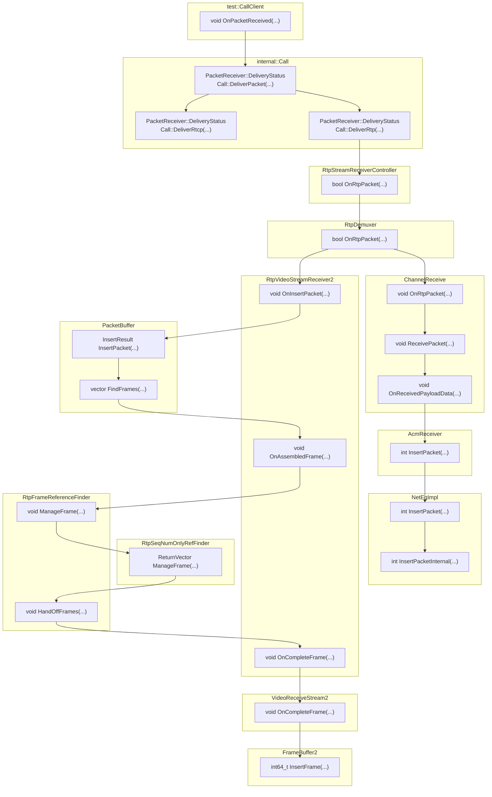

`src/test/scenario/call_client.cc` 定义了CallClient类，用于在测试中模拟RTC通讯的一端。

在pcap-webrtc模块中，实现WebRTC通话模拟的核心就是要让ns3和CallClient进行交互。
# CallClient作为接收者

当CallClient作为接收端时，其行为逻辑相对容易理解。

从数据包的角度看，它只需要将接收到的数据包转交给持有的Call对象即可。后续WebRTC对数据包的处理过程不需要CallClient的介入。所以只需要将Socket接收到的UDP包传入CallClient的`OnPacketReceived()`方法即可。



# CallClient作为发送者

相比之下CallClient作为发送端时的情形要复杂一些，这是因为发送端要使用pacer控制数据包的发送行为，这使得Socket的行为不能独自进行。

Socket和Pacer产生联系的方式是CallClient提供Transport接口实现，作为数据包发送的方式。接口包括发送RTP和RTCP的方法：

```cpp
// api/call/transport.h
class Transport {
 public:
  virtual bool SendRtp(const uint8_t* packet,
                       size_t length,
                       const PacketOptions& options) = 0;
  virtual bool SendRtcp(const uint8_t* packet, size_t length) = 0;

 protected:
  virtual ~Transport() {}
};

// test/scenario/call_client.h
std::unique_ptr<NetworkNodeTransport> transport_;
```

这里的`NetworkNodeTransport`是WebRTC提供的测试用传输对象，只需要将其改为`RtcSender`和`RtcReceiver` 即可：

```cpp
void SetCustomTransport(TransportBase *transport,bool own);
```

CallClient的`transport_`成员会传递给

```cpp
webrtc::AudioSendStream::Config::Transport* send_transport;
webrtc::AudioReceiveStream::Config::Transport* rtcp_send_transport;
webrtc::VideoSendStream::Config::Transport* send_transport;
webrtc::VideoReceiveStream::Config::Transport* rtcp_send_transport;
```

在它们作为数据发送者时，会调用 transport_ 提供的接口进行数据发送。以视频数据为例，`VideoSendStreamImpl` 类有一个成员变量

```cpp
RtpVideoSenderInterface* const rtp_video_sender_;
```


